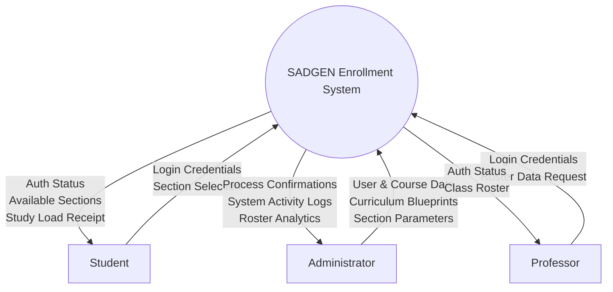
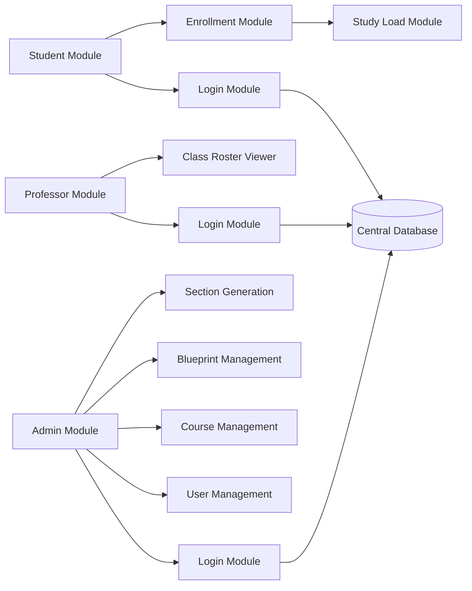
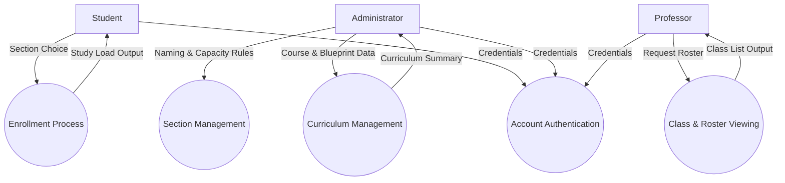
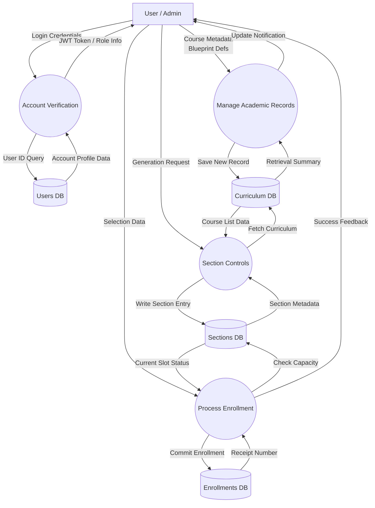
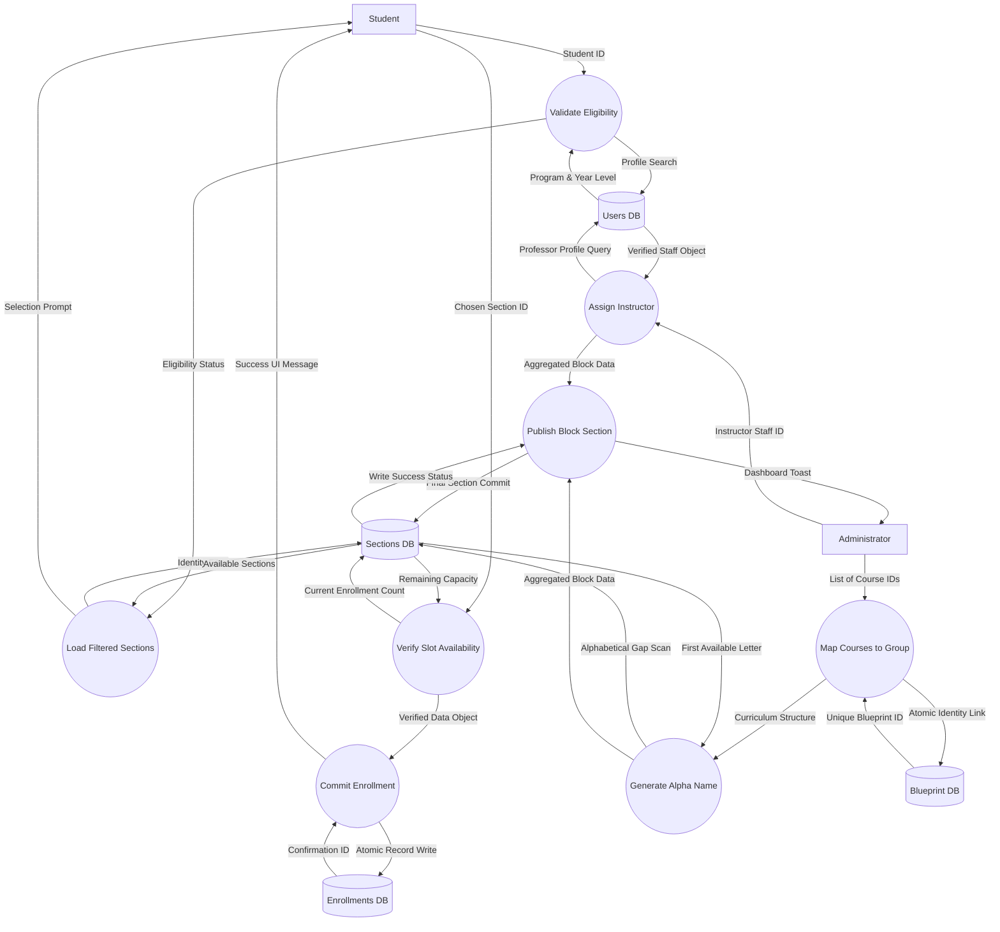

# SADGEN Enrollment System Diagrams

This document illustrates the functional flow and architectural structure of the **SADGEN Enrollment System**. The diagrams follow a progressive level of detail, from broad system interactions to specific data-handling processes.

---

## 1. DFD Level 0: Context Diagram
The Context Diagram represents the entire SADGEN system as a single central process, showing high-level data exchanges with external entities.

---

## 2. System Architecture
High-level layout showing the modular separation of concerns and the central database hub.

---

## 3. DFD Level 1: Broad Overview (Processes & Entities)
Breaking down the central system into its primary functional modules.

---

## 4. DFD Level 2: Medium Specificity (Data Flows & Storage)
Detailed interactions showing how specific data elements move between users, processes, and database stores.

---

## 5. DFD Level 3: Specific Detail (Granular Workflows)
The highest level of specificity, breaking down internal system logic into atomic steps with precise data labels.

