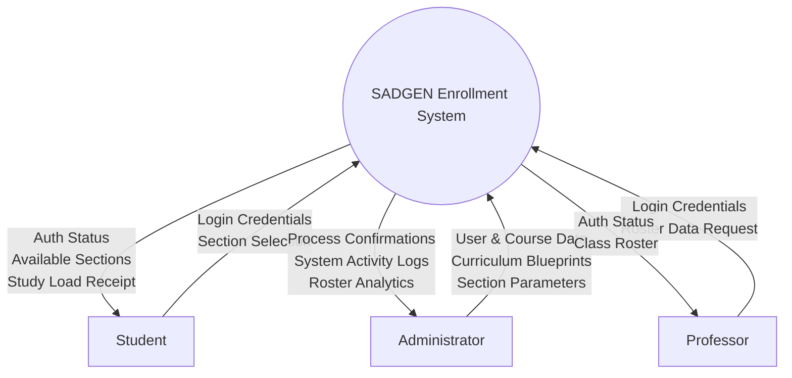
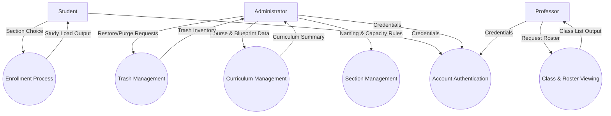
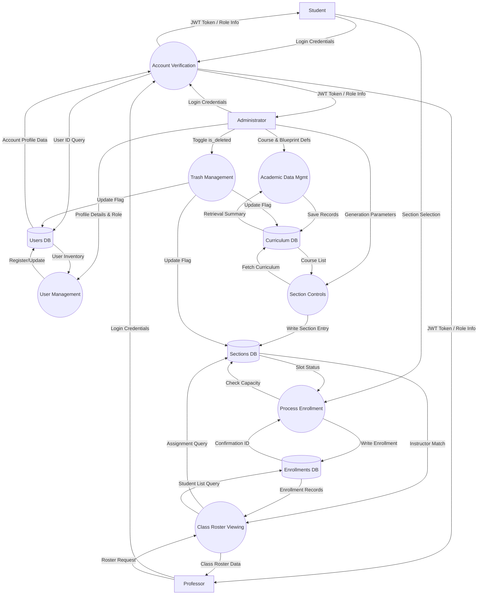
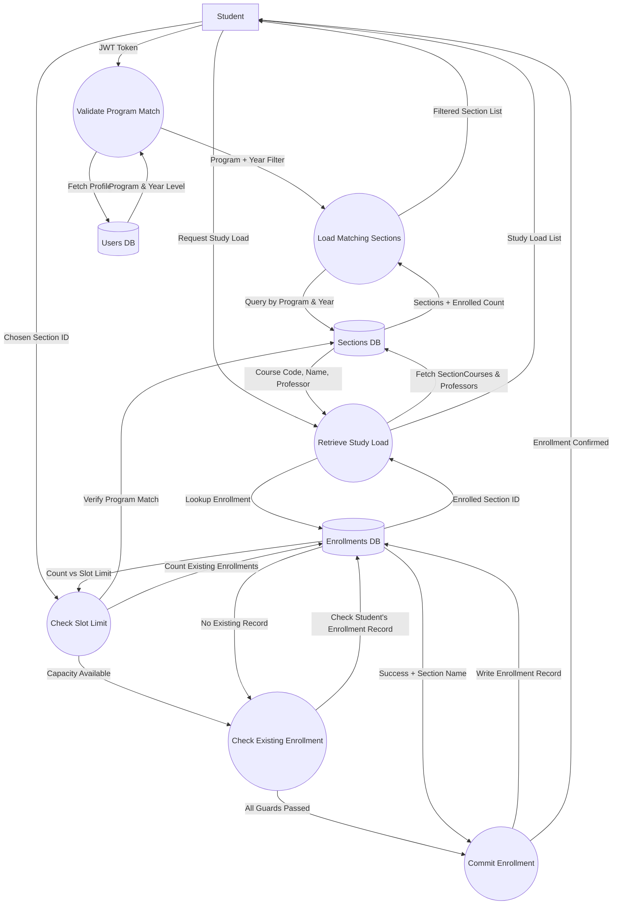
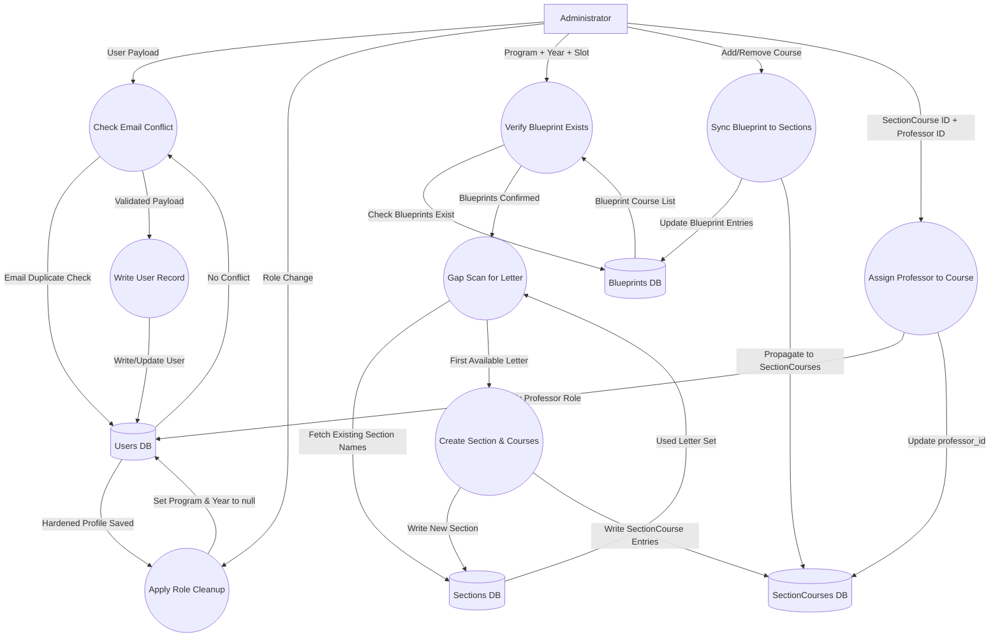
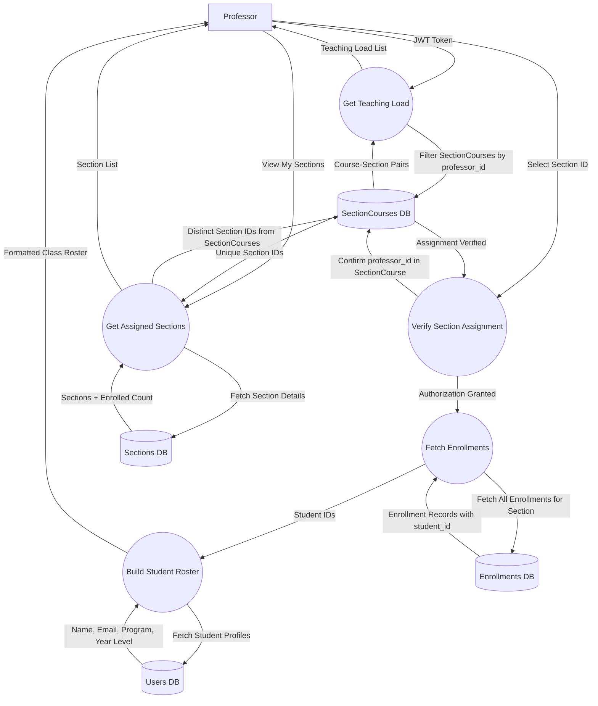
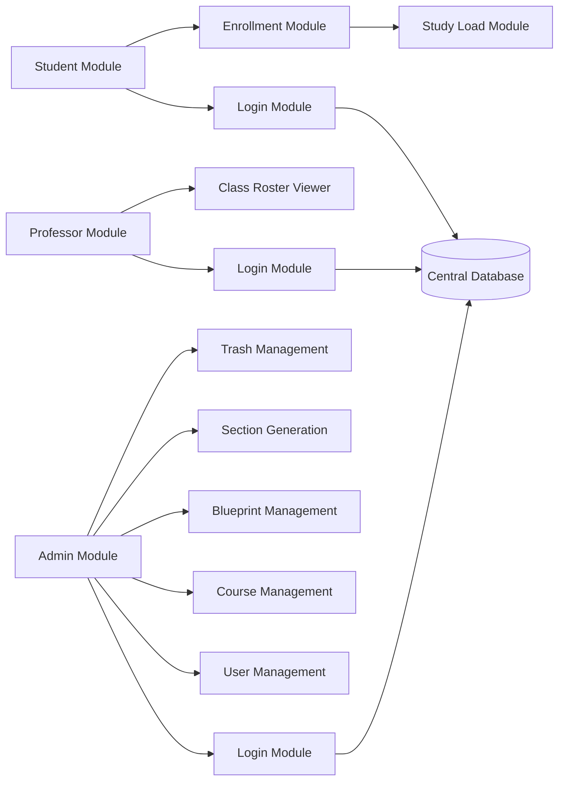

# College of Computer Studies

**Final Activity**  
**Human Computer Interaction 2**  
**LEC**

## System Modeling (DFD & System Architecture)

**Submitted by:**  
Anahaw, Samantha Isabel N.  
Austria, Arden Roland Nicholai M.  
Emperador, Radge Michael A.

**Submitted to:**  
Ma'am Ginalyn I. Contillo

**Date:** May 8, 2026

**Chosen System:** Enrollment System

---

# Data Flow Diagram (DFD)

## 1. Context Diagram

### **Description:**
The Context Diagram defines the outermost boundary of the SADGEN Enrollment System by mapping it as a single process against its three external actors.

The **Administrator** is the sole data configurator — they feed the system with user accounts, course definitions, curriculum blueprints, and section parameters. In return, the system outputs process confirmations and activity logs.

The **Student** is the primary transactional user — they submit login credentials and a section selection, and the system returns a filtered list of eligible sections and a Study Load receipt upon successful enrollment.

The **Professor** is a read-only consumer — they authenticate and request their assigned class data, receiving a formatted class roster in return. No data is written back to the system from the Professor.

---

## 2. Level 1 DFD

### **Description:**
The Level 1 DFD breaks the system into six primary processes and establishes which external entity owns each one.

**P1 (Account Authentication)** is the shared entry point for all three roles, issuing a JWT token that governs all subsequent access. **P2 (Curriculum Management)** and **P3 (Section Management)** are exclusive to the Administrator, handling the creation of courses, blueprints, and automatically named block sections. **P4 (Enrollment Process)** is the core student-facing transaction, producing a Study Load output on success. **P5 (Class & Roster Viewing)** serves the Professor as a read-only query endpoint. **P6 (Trash Management)** is an Admin-only recovery interface for soft-deleted records.

---

## 3. Level 2 DFD

### **Description:**
The Level 2 DFD introduces the four core relational data stores and shows which process group reads from or writes to each one.

All three actors share the **Account Verification** process, which queries D1 (Users DB) to validate credentials and return a role-scoped JWT. The Administrator operates across three separate write paths: **User Management** writes directly to D1; **Academic Data Management** reads and writes to D2 (Curriculum DB); and **Section Controls** reads blueprint data from D2 and writes the generated section into D3 (Sections DB). The **Trash Management** process toggles the `is_deleted` flag on records across D1, D2, and D3 without performing a hard delete.

The Student's **Enrollment Process** reads D3 to verify slot availability, then commits a new record to D4 (Enrollments DB). The Professor's **Roster Viewing** process queries D3 to identify assigned sections, then reads D4 to retrieve the student enrollment records.

---

## 4. Level 3 DFD (Granular Workflows)

### 4.1 Student: Enrollment & Study Load

### **Description:**
This diagram traces the full student journey across two phases: **enrollment** and **study load retrieval**.

In the enrollment phase, the system first fetches the student's profile from D1 to extract their program and year level. It then filters D3 (Sections DB) to return only matching sections. When the student selects a section, two sequential guards are enforced: (1) a **slot limit check** that counts current enrollments in D4 against the section's capacity, and (2) an **existing-enrollment check** that blocks any student already registered in another section. Only when both pass is a new record written to D4.

In the study load phase, the system looks up the student's active enrollment in D4, retrieves the linked section from D3, and traverses the SectionCourses relationship to return each subject's course code, course name, and assigned professor name.

---

### 4.2 Administrator: User, Blueprint & Section Management

### **Description:**
This diagram documents four independent administrative workflows that share the same data stores.

**User Management (P2.1–P2.3):** Before creating a user, the system checks D1 for an email duplicate. On success, the user record is written to D1. When a role is changed away from Student, the system immediately nullifies the `program` and `year_level` fields in D1 to prevent stale academic metadata.

**Section Generation (P2.4–P2.6):** The admin provides a program, year, and slot limit. The system first confirms a matching blueprint exists in D2. It then scans all existing section names in D3 to build a set of used alphabetical suffixes (e.g., A, B, C), and selects the first missing letter — this is the **Alphabetical Gap Scan**. The new section is written to D3 and all linked course entries are written to D4 (SectionCourses DB).

**Blueprint Sync (P2.7):** When a course is added to or removed from a blueprint in D2, the change is immediately propagated to all existing SectionCourse entries in D4 for matching sections.

**Assign Professor (P2.8):** The admin provides a SectionCourse ID and a Professor ID. The system verifies the professor's role in D1, then updates the `professor_id` field on the target SectionCourse record in D4.

---

### 4.3 Professor: Teaching Load & Roster Retrieval

### **Description:**
This diagram reflects the three read-only professor-facing endpoints, all rooted in the `SectionCourses` table as the source of truth for professor assignments.

**Get Teaching Load (P3.1):** The system filters D4 (SectionCourses DB) by the professor's JWT-decoded ID, returning all course-section pairs they are assigned to teach.

**Get Assigned Sections (P3.2):** The system queries D4 for the distinct set of section IDs where the professor appears, then fetches the corresponding section records from D3 (Sections DB), including a live count of enrolled students.

**Roster Retrieval (P3.3–P3.5):** Before accessing any student data, the system enforces an **authorization guard** by confirming the professor's ID exists in a SectionCourse record for the requested section. If verified, it fetches all enrollment records from D5 (Enrollments DB), extracts the student IDs, and retrieves each student's name, email, program, and year level from D1 (Users DB) to assemble the final class roster.

---

## 5. System Architecture Diagram

### **Description:**
The System Architecture Diagram illustrates the modular, role-based structure of the SADGEN portal across three layers.

All three roles (Student, Admin, Professor) pass through a shared **Login Module** before accessing their respective portals. Each module communicates with a **Central Database** through the backend API.

The **Student Module** connects to an **Enrollment Module** for section registration and a **Study Load Module** for viewing enrolled courses. The **Admin Module** branches into five sub-modules: **User Management** (account creation and role control), **Course Management** (subject definitions), **Blueprint Management** (curriculum groupings), **Section Generation** (automated block creation with gap-scan naming), and **Trash Management** (soft-delete and restore logic). The **Professor Module** connects to a **Class Roster Viewer** for reading assigned sections and student lists.

The frontend is built in Vanilla JavaScript using a component-based SPA architecture. The backend is a FastAPI REST API that enforces role-based access control via JWT tokens. Persistence is handled by SQLAlchemy ORM over SQLite (development) or PostgreSQL (production).

---

## Short Explanation:

The diagrams in this document collectively model the SADGEN Enrollment System across four levels of abstraction, from boundary definition to atomic code-level logic.

The **Context Diagram** establishes the system's three actors and their high-level inputs and outputs — the Admin configures the system, the Student transacts with it, and the Professor reads from it.

The **Level 1 DFD** decomposes the system into six functional processes, clarifying which role owns each process and what data flows between them at a conceptual level.

The **Level 2 DFD** introduces the four relational data stores and maps which process group reads from or writes to each one, revealing how the Admin, Student, and Professor flows are physically separated at the database level.

The **Level 3 DFDs** provide the highest fidelity by documenting the actual logic enforced in the backend code — including enrollment guards, the alphabetical gap scan for section naming, blueprint-to-section synchronization, and the professor authorization check before roster access.

Finally, the **System Architecture Diagram** maps these data flows to the concrete technology stack: a Vanilla JS SPA frontend, a FastAPI REST backend with JWT-based role control, and a SQLAlchemy-managed relational database. Together, these models demonstrate a system built for correctness, data integrity, and a frictionless multi-role user experience.

```mermaid
graph TD
    %% 1. Entities & External Systems
    Admin[Admin]
    Student[Student]
    Professor[Professor]
    DBMS[(Database)]
    CloudStorage[(Cloud Storage)]

    %% 2. Admin Flow: Configuration & Provisioning
    Admin -->|Login Credentials| P1_1[Authentication]
    Admin -->|System Config| P2_1[Manage User Roles]
    Admin -->|Manage Course Catalog| P2_3[Manage Courses]
    Admin -->|Manage Programs| P2_5[Manage Curriculums]
    Admin -->|Create Sections| P2_6[Generate Sections]
    Admin -->|Upload Files| P2_2[File Upload Service]

    %% 3. Student Flow: Learning & Enrollment
    Student -->|Login Credentials| P1_1
    Student -->|Enroll/Withdraw| P3_1[Enrollment Service]
    Student -->|View Schedule| P3_2[View Study Load]
    Student -->|Download Materials| P3_3[File Download Service]

    %% 4. Professor Flow: Teaching & Administration
    Professor -->|Login Credentials| P1_1
    Professor -->|View Load & Roster| P4_1[Roster Management]
    Professor -->|Upload Materials| P4_2[File Upload Service]
    Professor -->|Manage Grades| P4_3[Grade Management]

    %% 5. Backend Services & Data Flows
    P1_1 -->|JWT Token| S1[Backend API Gateway]
    S1 -->|Auth Check| AuthSvc[Authentication Service]
    AuthSvc -->|Validate Credentials| DBMS

    P2_1 -->|Create/Update/Delete User| UserSvc[User Service]
    UserSvc -->|CRUD Operations| DBMS
    UserSvc -->|Generate Credentials| MailSvc[Email Service]

    P2_3 -->|Manage Courses| CourseSvc[Course Service]
    CourseSvc -->|CRUD Operations| DBMS

    P2_5 -->|Manage Blueprints| BlueprintSvc[Blueprint Service]
    BlueprintSvc -->|CRUD Operations| DBMS

    P2_6 -->|Generate Sections| SectionSvc[Section Service]
    SectionSvc -->|Naming Algorithm| Algo[Gap Scan Algorithm]
    Algo -->|Create Sections| DBMS
    Algo -->|Map Courses| DBMS

    P2_2 -->|Upload Files| FileSvc[File Service]
    FileSvc -->|Store File| CloudStorage
    CloudStorage -->|Generate Presigned URL| S1

    P3_1 -->|Enrollment Logic| EnrollSvc[Enrollment Service]
    EnrollSvc -->|Check Capacity| DBMS
    EnrollSvc -->|Create Enrollment| DBMS
    EnrollSvc -->|Create Activity Log| ActivitySvc[Activity Service]

    P3_2 -->|Fetch Schedule| LoadSvc[Study Load Service]
    LoadSvc -->|Query Enrollments| DBMS
    LoadSvc -->|List Courses| DBMS

    P3_3 -->|Download File| FileSvc
    FileSvc -->|Get URL| CloudStorage

    P4_1 -->|Get Roster| RosterSvc[Roster Service]
    RosterSvc -->|Query Section & Students| DBMS
    RosterSvc -->|Check Auth| AuthSvc

    P4_2 -->|Upload Files| FileSvc

    P4_3 -->|Manage Grades| GradeSvc[Grade Service]
    GradeSvc -->|Check Assignment| DBMS
    GradeSvc -->|Update Grades| DBMS
    GradeSvc -->|Notify Student| MailSvc

    %% 6. System-Wide Flows
    S1 -->|All Requests| DBConn[Database Connection Pool]
    DBConn -->|SQL Queries| DBMS

    subgraph "External Systems"
        DBMS
        CloudStorage
        MailSvc
    end

    subgraph "Backend Microservices"
        S1
        AuthSvc
        UserSvc
        CourseSvc
        BlueprintSvc
        SectionSvc
        Algo
        FileSvc
        EnrollSvc
        LoadSvc
        RosterSvc
        GradeSvc
        ActivitySvc
    end
```

